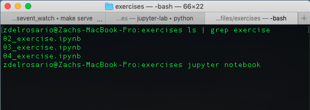
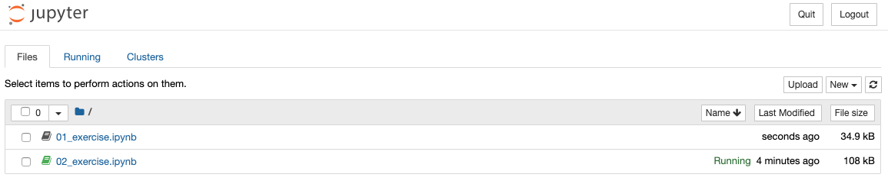
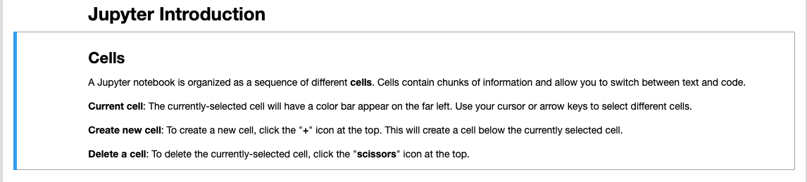
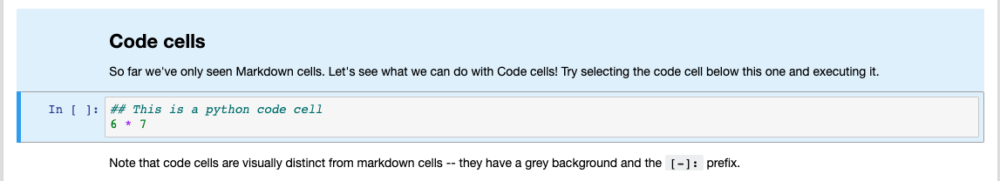

### Python
<!-- ------------------------- -->

Python is a [*programming language*](https://www.python.org), and an extremely
popular one at that. Python is praised for its readability, is consistently
ranked as a top programming language, and is used by both top [software
companies](https://en.wikipedia.org/wiki/Python_(programming_language)#Uses) and
scientists doing computation. All of this is to say that knowing how to write
Python code is a valuable skill.

### Jupyter
<!-- ------------------------- -->

Jupyter is a [*programming environment*](https://jupyter.org), often used for
writing and sharing Python code. Just as one could choose to write English on
stone tablets or on paper, one could choose to write Python code in simple files
or in *jupyter notebooks*. These notebooks are useful for a number of reasons:

1. Multimedia: This document you're reading now is a jupyter notebook -- it is a
   combination of (executable) Python code and (formatted) plain text. By
   allowing the juxtaposition of different media (code and natural language, to
   name a couple options), one can provide human-readable context next to
   executable software.

2. Saves state: Jupyter notebooks *save state*, allowing you to run some code,
   save the results, close the document and come back to it later. This is
   certainly possible in other coding environments, but jupyter has built-in
   facilities to make this easy.

3. Reproducible:
   [Reproducibility](https://en.wikipedia.org/wiki/Reproducibility) is a
   critical issue in science -- results cannot be considered scientifically
   valid unless they can be reproduced under similar conditions. The same
   principles apply to computational experiments; all too often software is
   written under time pressure, resulting in scattered documentation and
   analysis. Consolidating documentation and analysis within a single notebook
   facilitates scientific reproducibility.

Jupyter notebooks are not *always* the best media for writing code; for
instance, python *packages* are not written in jupyter notebooks. However, for
our purposes, jupyter is a good solution.

## Working in Jupyter
<!-- -------------------------------------------------- -->

**Jupyter notebooks do not open like regular files.** You need to *launch* the
jupyter client, which will open a tab in your web browser. Navigate with your
terminal to where you've downloaded the exercises for this workshop, and use the
command `jupyer notebook` to launch jupyter.

Once you launch jupyter, you should see a page like the following. Click on
`01_exercise.ipynb` to open the notebook associated with this lesson. For your
reference, you can also click `New` to create a new notebook.

A Jupyter notebook is organized as a sequence of different **cells**. Cells
contain chunks of information and allow you to switch between text and code.

**Current cell**: The currently-selected cell will have a color bar appear on
the far left. Use your cursor or arrow keys to select different cells.

**Create new cell**: To create a new cell, click the "**+**" icon at the top.
This will create a cell below the currently selected cell.

**Delete a cell**: To delete the currently-selected cell, click the
"**scissors**" icon at the top.

### Types of Cells
<!-- ------------------------- -->

**Markdown Cells** contain formatted text (and other media, like images), and
are often used for explanations.

**Code Cells** contain python code, and can be executed.

With a code cell selected, you can press `Control + Enter` to execute the cell.
By default, the result of the last line will be printed.

**Edit a cell**: To edit a cell, click inside to start editing -- the blue bar
on the left will turn green, and you can begin typing. For *markdown cells*, you
may need to **triple-click** in order to start editing.[^1] This is so you can
choose to either interact with the text (access links, highlight and copy text,
etc.) or triple-click to start editing.

## Python Basics
<!-- -------------------------------------------------- -->

### Python as a calculator
<!-- ------------------------- -->

We can use python as a calculator; many of the basic operations we might expect
are available:

> ## Examples
> Addition
> ~~~
> 2 + 2
> ~~~
> {: .language-python}
>
> ~~~
> 4
> ~~~
> {: .output}
> Multiplication
> ~~~
> 6 * 7
> ~~~
> {: .language-python}
>
> ~~~
> 42
> ~~~
> {: .output}
> Modulus
> ~~~
> 3 % 2
> ~~~
> {: .language-python}
>
> ~~~
> 1
> ~~~
> Some operations are not available by default
> ~~~
> log(10)
> ~~~
> {: .language-python}
>
> ~~~
> Traceback (most recent call last):
>  File "<stdin>", line 1, in <module>
> NameError: name 'log' is not defined
> ~~~
> {: .output}
> We can gain access to more operations by importing *packages*, which we'll discuss soon.
{: .callout}

### Variables
<!-- ------------------------- -->

*Variables* are part of what separates python from a "mere calculator". By using
variables, we can write code to perform the same operations multiple times, but
using different data.

> ## Variables as Sticky Notes
>
> A variable is analogous to a sticky note with a name written on it:
> assigning a value to a variable is like putting that sticky note on a particular value.
>
> 
>
> This means that assigning a value to one variable does **not** change
> values of other variables.
> For example, let's store the subject's weight in pounds in its own variable:
>
> ~~~
> # There are 2.2 pounds per kilogram
> weight_lb = 2.2 * weight_kg
> print(weight_kg_text, weight_kg, 'and in pounds:', weight_lb)
> ~~~
> {: .language-python}
>
> ~~~
> weight in kilograms: 65.0 and in pounds: 143.0
> ~~~
> {: .output}
>
> 
>
> Let's now change `weight_kg`:
>
> ~~~
> weight_kg = 100.0
> print('weight in kilograms is now:', weight_kg, 'and weight in pounds is still:', weight_lb)
> ~~~
> {: .language-python}
>
> ~~~
> weight in kilograms is now: 100.0 and weight in pounds is still: 143.0
> ~~~
> {: .output}
>
> 
>
> Since `weight_lb` doesn't "remember" where its value comes from,
> it is not updated when we change `weight_kg`.
{: .callout}

### Data Types
<!-- ------------------------- -->

Variables in python each have a *type*. Some common ones include:

- Integers
- Decimal numbers (floating point values)
- Strings

Generally, we will use different data types for different purposes. We might use
a floating point value (a *float*) to represent a physical quantity, like a
weight. We might use an integer to represent a count of entires, or possibly an
index to an array. We might use a string to represent a chemical compound name,
like `"Ti6V4Al"`.

Sometimes we may want to mix different datatypes together, which introduces the
idea of *casting* from one data type to another. The following examples
illustrate some issues with casting.

> ## Examples
> Let's add an integer and a float
> ~~~
> 1 + 2.
> ~~~
> {: .language-python}
>
> ~~~
> 3.0
> ~~~
> {: .output}
> Note that the output is now a float, as evidenced by the decimal point.
> The integer was *cast* in order to carry out addition.
>
> ~~~
> 1 + "s"
> ~~~
> {: .language-python}
>
> ~~~
> Traceback (most recent call last):
>   File "<stdin>", line 1, in <module>
> TypeError: unsupported operand type(s) for +: 'int' and 'str'
> ~~~
> {: .output}
> This operation throws an error; python cannot meaningfully interpret how to add
> an integer and a string. However, if what we really want is to insert a value into
> a string -- say to build up a complex filename -- we can cast the value first.
> ~~~
> str(1) + "s"
> ~~~
> {: .language-python}
>
> ~~~
> "1s"
> ~~~
> {: .output}
{: .callout}

### Lists
<!-- ------------------------- -->

Lists are used to store multiple values together. They are created with the
`list()` function, or using bracket notation.

> ## Examples
> ~~~
> l = [1, 2, 3]
> ~~~
> {: .language-python}
> We can add to a list with `append()`
> ~~~
> l.append(4)
> ~~~
> {: .language-python}
> This changes the list *in-place*. We can also join two lists
> ~~~
> l2 = [1, 2, 3] + [4, 5, 6]
> ~~~
> {: .language-python}
> This *returns* a new list, which we capture here with the variable `l2`.
{: .callout}

### Indexing and slicing
<!-- ------------------------- -->

We can *index* lists (and other python *iterables*) by using bracket notation.

> ## Examples
> Python is a zero-based indexed language; the "first" element has index `0`,
> the "second" element has index `1`, and so on. It can be helpful to think
> of the index as "the offset from the first element", so the second element
>  is `1` away from the first. By this logic, it is reasonable that the first
> element is `0` away from itself.
> ~~~
> l = [1, 2, 3]
> l[0]
> ~~~
> {: .language-python}
>
> ~~~
> 1
> ~~~
> {: .output}
>
> Negative indices come "from the right".
> ~~~
> l = [1, 2, 3]
> l[-1]
> ~~~
> {: .language-python}
>
> ~~~
> 3
> ~~~
> {: .output}
{: .callout}

We can also use *slicing* to access multiple values.

> ## Examples
> We use a `:` to denote a range of indices to return.
> ~~~
> l = [0, 1, 2, 3, 4]
> l[1:3]
> ~~~
> {: .language-python}
>
> ~~~
> [1, 2]
> ~~~
> {: .output}
>
> We might have expected this to return `[1, 2, 3]`. Note that the first slice
> index is *inclusive*, while the last is *exclusive*. We need to specify the
> last index as one-past the element we actually want.
>
> We can also slice with negative indices.
>
> ~~~
> l[1:-1]
> ~~~
> {: .language-python}
>
> ~~~
> [2, 3, 4]
> ~~~
> {: .output}
{: .callout}

### Modules
<!-- ------------------------- -->

Modules help extend the functionality of python by providing specialized tools.
We work with modules by first using the `import` keyword, then accessing their
contents through `.` notation:

> ## Examples
> ~~~
> import numpy
> X = numpy.array([1, 2, 3])
> ~~~
> {: .language-python}
>
> A large number of functions are available through `numpy`. We access them by
> specifying that we want to use function `array` from `numpy` with the syntax
> `numpy.array`.
>
> We can create shortcuts to help reduce typing.
>
> ~~~
> import numpy as np
> X = np.array([1, 2, 3])
> ~~~
> {: .language-python}
>
{: .callout}

Here is a non-exhaustive list of modules, particularly those useful for
materials informatics.

- `numpy` -- n-dimensional arrays
- `scipy` -- scientific computing functions
- `matplotlib` -- essentially a port of MATLAB's plotting functions
- `sympy` -- symbolic mathematics toolkit
- `pandas` -- data structures and analysis
- `scikit-learn` -- machine learning tools
- `matminer` -- featurizing inorganic compounds
- `mordred` -- featurizing organic compounds

### Conditionals and logic
<!-- ------------------------- -->

### Loops
<!-- ------------------------- -->

### Numpy Arrays
<!-- ------------------------- -->

[^1]: Really, you need to click once to select the cell, then double-click to start editing. You can always triple-click, though.


