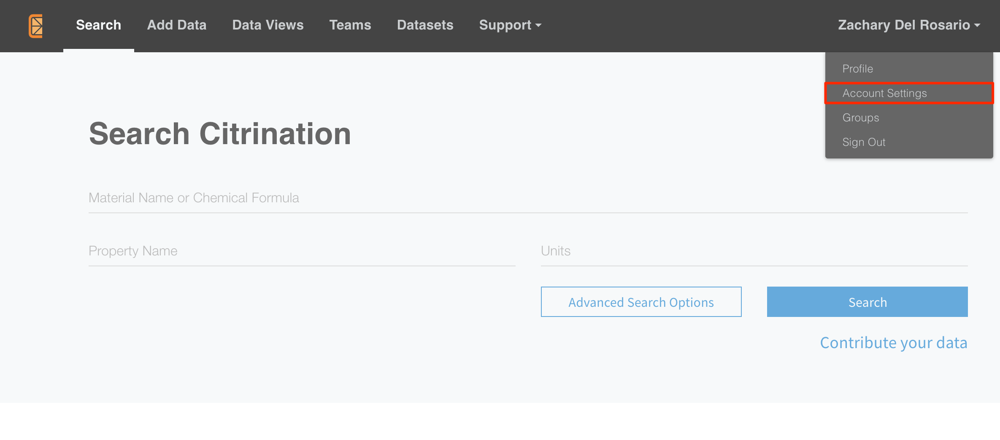
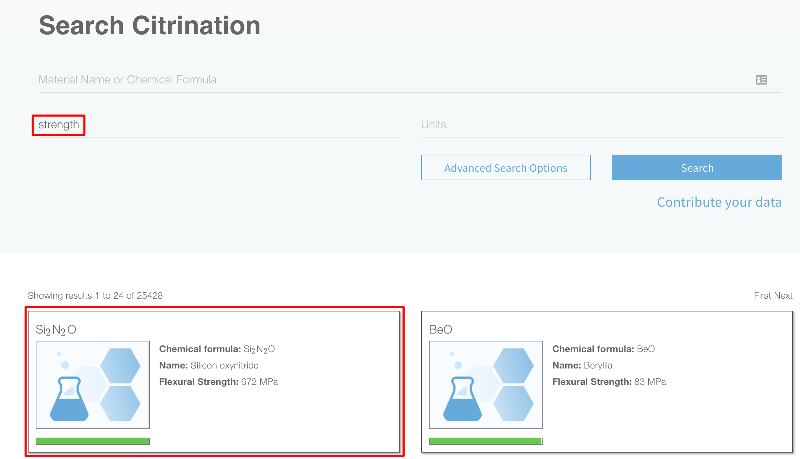
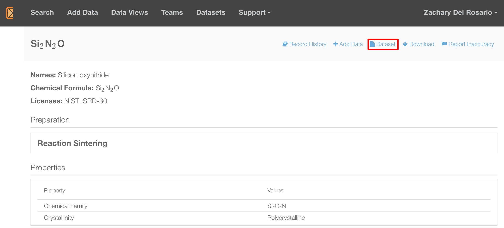
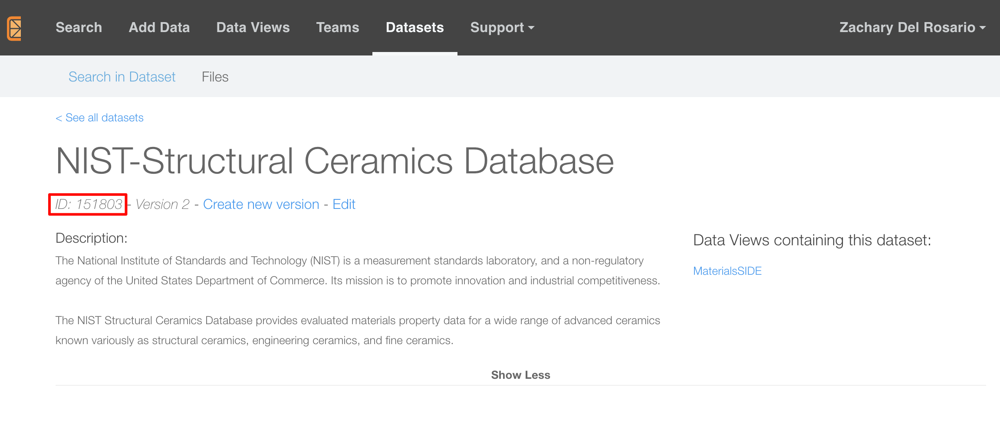

## Application Programming Interfaces (APIs)
<!-- -------------------------------------------------- -->

An *application programming interface* (API) is a kind of [software
link](https://www.mulesoft.com/resources/api/what-is-an-api); it provides a
programmer with access to a server or other software service. In our case, we
will use the API for
[Citrination](https://citrination.com/search/simple?searchMatchOption=fuzzyMatch)
to search for and access materials data.

We will start by
[setting-up](https://github.com/CitrineInformatics/learn-citrination/blob/master/citrination_api_examples/clients_sequence/1_data_client_api_tutorial.ipynb)
the Citrination API. You will first need to [sign
up](https://citrination.com/users/sign_in) for an account. After creating an
account, navigate to "Account Settings" to find your API key.

> ## Protip: Don't share your API key!
> An *API key* is like a password -- it is a secret access code that grants you entry
> to a system. In this workshop this is not such an issue, but if you were to upload
> secret or sensitive data to Citrination (or another database) and gave your API
> key to someone else (accidentally or otherwise), that person could use your key
> to access your data.
{: .callout}

### Setting up your API key
<!-- -------------------------------------------------- -->

To access Citrination, you will need to provide your API key. **However, we
strongly discourage you from copy-pasting this key into scripts that you
write**.[^1] Instead, we will configure your computer to store your API key in
an operating system-wide variable, and write our scripts to load that variable.
This section will describe how to do this.

In OS X or Linux, the following instructions will work:

- In Terminal, type vim ~/.bash_profile (or use an editor of your choice).
- In that file, press i (edit mode) and add the line export CITRINATION_API_KEY="your_api_key".
- Save and exit (Esc, :wq, Enter).
- Open up a new Terminal and load this notebook one more time.

On Windows, this is [*more
complicated*](https://www.computerhope.com/issues/ch000549.htm), but still
manageable.

### Initializing the API
<!-- -------------------------------------------------- -->

After you have saved your API key and restarted your terminal, you can set about
using your key to access Citrination. The following packages will be necessary
to do so.

~~~
# Standard packages
import os # To read your API key from the environment variable

# Third-party packages
from citrination_client import * # To use the API function calls

# Initialize client
~~~
{: .language-python}

The following code will read the environment variable `CITRINATION_API_KEY` and
use it to access Citrination.

~~~
site = "https://citrination.com"
client = CitrinationClient(
    api_key = os.environ.get('CITRINATION_API_KEY'),
    site = site
)
client # reveal the attributes
~~~
{: .language-python}

### Accessing data
<!-- -------------------------------------------------- -->
Next, we will use the client to initialize the *search client*. This will enable
us to search Citrination for data, and load it onto our computer for local
analysis.

The search client is very powerful, but is also rather complex. We will build up
a simple search below for illustrative purposes, but see the [search client
tutorial](https://github.com/CitrineInformatics/learn-citrination/blob/master/citrination_api_examples/clients_sequence/4_search_client_api_tutorial.ipynb)
for more information.

In practice, I recommend using the Citrination
[Search](https://citrination.com/search/simple?searchMatchOption=fuzzyMatch) or
[Datasets](https://citrination.com/datasets) tab to find what you're interested
in, then start constructing an API call to match. For instance, I searched for
materials with the "strength" property, found a ceramic with strength values,
then navigated to its parent dataset.

Searching for materials with a "strength" property.

Inspecting a ceramic with "strength" properties, following the parent dataset.

Below I took the NIST Ceramics dataset ID above and assigned it to a Python
variable for later access.

~~~
## Identify desired dataset's ID number
dataset_id = 151803 # NIST structural ceramics dataset
~~~
{: .language-python}

Using an initialized `client`, one can then call `client.search` along with a
structured query to access data. I give an example of this syntax below -- the
following code accesses a specific database by an id number, and returns up to
`5000` results.

~~~
## Build search query
search_client = client.search
query = \
    PifSystemReturningQuery(
        size = 5000,                              # Maximum number of results to return
        query=DataQuery(
            dataset=DatasetQuery(                 # Search among datasets
                id=Filter(equal=str(dataset_id))  # Match the dataset ID
            )
        )
    )

## Inspect results
query_result = search_client.pif_search(query)
print("Found {} PIFs in dataset.".format(query_result.total_num_hits, dataset_id))
~~~
{: .language-python}

We may access results through the `query_result` object. You will learn how to
do this in the Exercise at the end of this lesson.

Citrination stores data in the form of [*physical information
files*](http://citrineinformatics.github.io/pif-documentation/) (PIFs) -- an
open-source standard for storing data about physical objects. While PIFs are
convenient for storing information, they are less convenient for data analysis
and machine learning. Below, we'll discuss *data wrangling* -- transforming data
from one form to another desired format.

## Exercise
<!-- -------------------------------------------------- -->

> ## Exercise: API Exercise
>
> Complete [02_pycc_exercise.ipynb](../files/exercises/02_pycc_exercise.ipynb)
{: .challenge}

[^1]: If you were to share a script with your API key, you will have shared your key with someone else. Game over!


