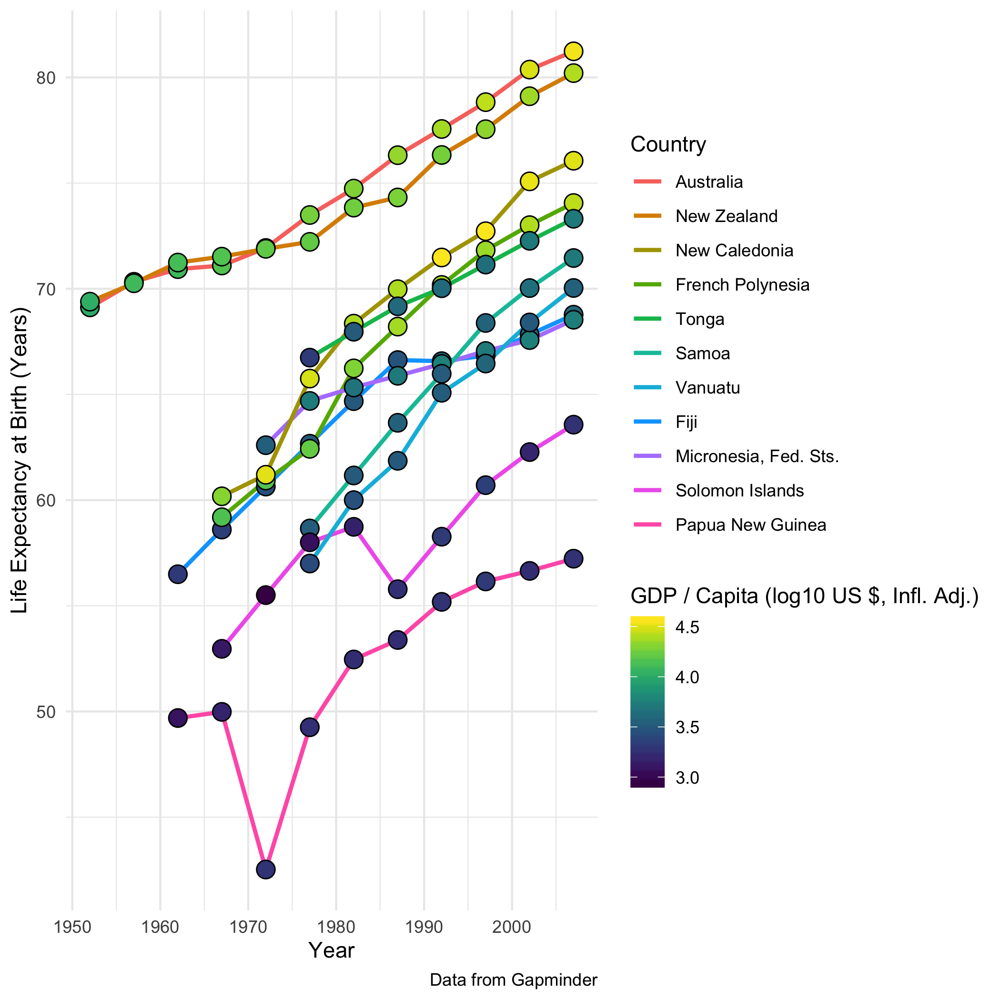

In this lesson, we will illustrate different methods of visualizing information,
and rank them according to _the visual hierarchy_.

## The Visual Hierarchy
<!-- -------------------------------------------------- -->
The visual hierarchy was proposed by Cleveland and McGill in 1985.[^1] The
concept is that certain *perceptual tasks* -- small components of interpreting
graphics -- lead to more or less accurate interpretations of data. More accurate
depictions of data result in a more readable visualization of data; since our
goal should be to both learn and communicate information as clearly as possible,
more accurate tasks are _better_ tasks.

Their hierarchy, in order of descending ease, is:

1. Position along a common scale
2. Position on identical but nonaligned scales
3. Length
4. Angle; Slope[^2]
5. Area
6. Volume; Density; Color saturation
7. Color hue

To illustrate some of these perceptual tasks, let's consider the following six
depictions of _identical_ data. These dataset is from the UCI Machine Learning
Repository.[^3] The data describe imported automobiles from the 1980's, while
the figures themselves depict the _count_ of automobiles in various categories.
Each of the figures depicts _exactly the same_ variables, but _encodes_ the data
in different ways.

__Position along a common scale__: Note that here, comparing every category is
easy, as all values are depicted on a common (horizontal) scale. Note that this
is _not_ necessarily a good figure -- it would be more common to flip the axes
here (swap Count and Style), and the connecting lines between points are
unnecessary / distracting.

__Position on identical but nonaligned scales__: Here comparing within the `fwd`
and `rwd` groups is easy, but across the groups comparison is more challenging.
To make numerical comparisons, we can read values off the respective scales, and
compare those numbers in our heads. This method of comparison is less immediate
than the rung above.

__Length__: Here since the bars are "stacked", it is difficult to read the
values for the `fwd` group. For a numerical comparison, we could read the
numerical values for both endpoints of a `fwd` bar, subtract, and then compare
differences -- this would involve more calculation than either rung above. We
could also try to compare the lengths of the bars directly -- this would be
more challenging than either rung above..

__Angle__: Here we have a situation similar to above, but with values arranged
radially. Both decoding schemes from "Length" can be applied similarly, but with
added difficulty in interpreting angles rather than lengths.

__Area__: Here quantitative values (below, `Counts`) are encoded as the area of
circles. While making _qualitative_ comparisons between highly dissimilar values
is possible (e.g. `wagon` vs `sedan`), comparisons between similar values is
challenging (e.g. `hatchback` vs `sedan` in `fwd`), as is making _quantitative_
comparisons.

__Color saturation__: Here the `Counts` are encoded as the color saturation of
equal-sized circles. Larger values are brighter, while smaller values are
darker. As with angle, distinguishing between similar values when using
saturation is quite challenging.

## Uses of the Rungs
<!-- -------------------------------------------------- -->
Now that we have seen the Visual Hierarchy, let's put it to use designing
visualizations. First, we'll study different visualizations of the same data,
and assess how well they do at conveying meaning.

### Gapminder Examples
<!-- ------------------------- -->
The following figures use data from the [Gapminder](https://www.gapminder.org/)
project. Both figures depict the same data and variables, but make different
choices about how to display the data.

__Gapminder A__: How are the variables `Population, GDP per Capita, Life
Expectancy at Birth, Continent` encoded visually? List any observations about
the data you see from the first visual:

__Gapminder B__: How are the variables `Population, GDP per Capita, Life
Expectancy at Birth, Continent` encoded visually? List any observations about
the data you can see in the next visual:

Did you make different observations using the two visualizations?

While its entirely possible using Gapminder A to see that `Life Expectancy at
Birth` is generally lower for African counteries, the pattern is quite a bit
more difficult to make out using a color scale, as opposed to a common
positional scale. It is also clearer from Gapminder B that there is an observed
(positive) correlation between `GDP / Capita` and `Life Expectancy at Birth`.
Version `B` is actually how the Gapminder project folks choose to [present their
own data](https://www.gapminder.org/tools/#$chart-type=bubbles).

Note that `Continent` takes only 5 discrete values; it is easy to find 5 colors
that stand apart well. I believe that Gapminder B above is the more effective
visualization, as it makes better use of our axes (positional scales).

Next, let's take a look at two additional visualizations using the Gapminder
data. Both depict timeseries of `GDP / Capita` and `Life Expectancy at Birth`,
but make different choices about which variable is depicted on a positional
scale.

Here it is less obvious to me which is the "better" of the two visualizations.
In the first it is easy to see that `Australia, New Caledonia, French Polynesia,
and New Zealand` cluster near each other in `GDP / Capita`, with a large gap
with the remaining Oceanic countries. In the second, it is much easier to see
the gap in `Life Expectancy at Birth` between `Austraila and New Zealand` and
the remaining countries.

Which is the "correct" choice depends on the purpose of the visualization. If
one variable has greater importance (and that variable takes many values), then
that variable should be placed on a positional scale. If all variables are
important, then it is important to prepare many different graphs and study them
all.

[^1]: Cleveland and McGill, "Graphical perception and graphical methods for analyzing scientific data" (1985) Science
[^2]: With slope not too close to 0, 90, or 180 degrees.
[^3]: UCI Machine Learning Repository, http://archive.ics.uci.edu/ml/index.php


