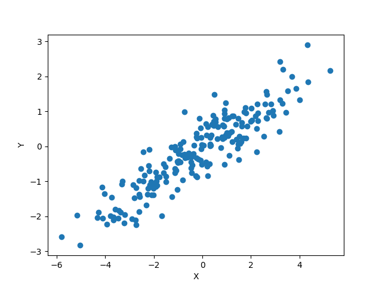

[Matplotlib](https://matplotlib.org/) is a *featureful* python library for
plotting. Its syntax is modeled on MATLAB, so it can help ease the transition
for ex-MATLAB users. In this lesson, we will learn a bit of matplotlib's syntax,
and about specific visualization techniques.

## Getting Started
<!-- -------------------------------------------------- -->
Matplotlib must be loaded like any other python package; it is common to use the
following `plt` alias to save ourselves some typing.

~~~
## Importing
import matplotlib.pyplot as plt
~~~
{: .language-python}

When working in a jupyter notebook, we need to pass some special syntax to
jupyter to get things to work properly.[^1]

~~~
## Importing for jupyter
%matplotlib inline
import matplotlib.pyplot as plt
~~~
{: .language-python}

In both cases, we may now access matplotlib functions through the `plt` prefix.
The anatomy of a matplotlib plot is as follows:

~~~
## Figure settings
plt.figure()     # Initializes a figure, allows you to configure some
                 # settings like the figure size

## Plot elements
plt.plot(X, Y)   # Call plot elements here, using your data (here X, Y)

## Annotations
plt.xlabel("X")  # Always remember to annotate your plots; at the minimum,
plt.ylabel("Y")  # all figures should have axis labels

## Final manipulations
plt.savefig("./images/result.png") # (Optional) Save your plot to disk
plt.close()                        # (Optional) Close the plot; useful if
                                   # you are writing many plots to disk,
							       # say in a loop
~~~
{: .language-python}

There are *a lot* of matplotlib functions, each with their own syntactic
intricacies. We will discuss a few common and useful plot types below.

> ## Protip
> Remember that calling `help(function)` from the python interpreter will give you
> documentation on `function`. This is especially helpful when you don't remember
> the precise syntax for a function!
>
> When using a jupyter notebook, you can navigate your cursor over a function and
> press the key-combination `Shift+Tab` to open the documentation for that function.
{: .callout}

## Histograms
<!-- -------------------------------------------------- -->
Histograms are a plot of **a single variable**. They allow us visualize *how
many* instances of a range of values occur in a dataset. This is helpful for
determining which values are more common than others. Histograms are perhaps
best understood as a generalization of the humble *barplot*.

In the case where a variable `X` can only take a discrete set of values -- let's
say `[A, B, C]` -- a barplot simply visualizes the count of observations that
fall into each category.

*However*, what if `X` instead took continuous values? In this case, it would
not be possible to simply sort the observations into discrete values and count
them up.

In the continuous case, we define a way to *hack* the data back into a discrete
setting. We choose a set of *bins*, and count the number of times the
observation of `X` falls into one of those bins. Often, the set of bins is
chosen *uniformly* across the observed domain (smallest to largest observed
value); in this setting, our only degree of freedom is the number of bins.[^2]
The result of binning the data in this way and producing a bar plot is called
a *histogram*, an example of which is shown below.

The histogram above uses `10` bins; the one below `20` bins. Note that different
"features" arise in the two plots of *the same data*. The tall 'spikes' we see
in the histogram above are sometimes called "fingers". These may -- or may not
-- be real features in the data. If real, this means values of `X` tend to
concentrate around that value. Unless you change the bin size (equivalently, the
count) to check if these features persist across *arbitrary plotting choices*,
you **cannot** be sure these features actually exist.

The following code will reproduce the two histograms above.

~~~
import numpy as np
import matplotlib.pyplot as plt
from scipy.stats import chi2

## Set seed for reproducibility
np.random.seed(101)

## Generate data
X = chi2.rvs(4, size = 50)

## hist1; default bin count
plt.figure()

plt.hist(
    X
)

plt.xlabel("X")
plt.ylabel("Count")

plt.savefig("../../fig/05_hist1.png")
plt.close()

## hist2; fewer bins
plt.figure()

plt.hist(
    X,
    bins = 20
)

plt.xlabel("X")
plt.ylabel("Count")

plt.savefig("../../fig/05_hist2.png")
plt.close()
~~~
{: .language-python}

> ## Rule #1 of Histograms
> When plotting data with a histogram, **always** play with the bin size. **Always**.
{: .callout}

Histograms provide us with a convenient means to study the entire *distribution*
of univariate (single-variable) data. However, sometimes we want to know simpler
*summaries* of the data. In this case, a *boxplot* is appropriate.

## Boxplots
<!-- -------------------------------------------------- -->

A *boxplot* is a visual summary of univariate data. [This
website](https://towardsdatascience.com/understanding-boxplots-5e2df7bcbd51)
gives a detailed introduction to boxplots, but the basic anotomy of a boxplot is:

* The median -- depicted as a solid bar in the middle -- gives the "center" of the data
* The lower and upper quartiles -- depicted as the ends of the box -- gives the
  "bulk" of the data
* The fences -- depicted as solid bars on the ends of the thin lines[^3] -- give
  the location of the "tails" of the data (the extremes)
* The outliers -- depicted as dots outside the fences -- are identified
  (heuristically) as uncharacteristically large or small values. Visually
  detecting outliers is one of the best uses of a boxplot

An *outlier* is somewhat vague term for an observation that does not "fit" the
rest of the data. If the majority of the data follow one pattern, outliers tend
to buck those trends. In a physical setting, outliers may be due to one-off
experimental errors... or may signal some exciting novel phenomena!

The figure below depicts a boxplot with no outliers. The median is just a bit
over `0.5`, the lower and upper quartiles are near `0.25` and `0.75`, and the
fences are near `0` and `1`.[^4]

The figure below depicts two sets of data `X1` and `X2` on the same vertical
axis, allowing direct comparison. We can see that `X2` tends to be more
concentrated -- visible as boxes and fences nearer to their respective median.
We can also see that `X2` seems to have five outliers, represented as the open
dots above and below the primary boxplot.

The figures above were generated with the following code.

~~~
import numpy as np
import matplotlib.pyplot as plt

## Set seed for reproducibility
np.random.seed(101)

## Generate some data to plot
X1 = np.random.random(20)
X2 = np.concatenate(
    (0.25 * np.random.random(15) + 0.25, # 'primary' data
     [0, 0.02, 0.9, 0.95, 0.99])         # 'outlier' data
)

## Single boxplot
plt.figure()
plt.boxplot(X1)

plt.xlabel("X")
plt.ylabel("Value")

plt.savefig("../../fig/05_boxplot1.png")
plt.close()

## Two boxplots
plt.figure()
plt.boxplot(
    [X1, X2]
)

plt.xlabel("X")
plt.ylabel("Value")

plt.savefig("../../fig/05_boxplot2.png")
plt.close()
~~~
{: .language-python}

A boxplot does not show us quite as much as a histogram -- much of the *shape*
of the data is obscured in computing the summaries (median, quartiles, etc.).
However, there are a few advantages to using boxplots:

* Quick identification of outliers
* Convenient visual depiction of summaries
* Easy to compare different cases (e.g. `X1` versus `X2` above)

So far, we have discussed ways to study observations of a *single* variable.
Next, we will discuss how to study the relation between *two* variables by using
a *scatterplot*.

## Scatterplots
<!-- -------------------------------------------------- -->
One of our primary tasks in analyzing data is to assess relationships between
variables. The simplest way to do this visually is to study *pairwise* relations
-- relations between just two variables. Depicting two variables along two
orthogonal axes may seem trivial, but this idea was only introduced in [the mid
1600's](https://en.wikipedia.org/wiki/Cartesian_coordinate_system#History).
Depicting observations on two variables as *points along two orthogonal axes* is
called a *scatterplot*.

The following scatterplot depicts data with a moderate *linear correlation*.

The following scatterplot depicts data with a strong linear correlation.

Scatterplots are particularly useful for inspecting patterns that are difficult
to describe with summary statistics. The following plot shows data which
formally have zero linear correlation, but clearly exhibit some relation.

**Depicting additional variables**

Unfortunately, it is *very* challenging to extend visualization with coordinate
systems beyond two dimensions. One can plot in three dimensions; however, these
displays are rarely effective for *communicating* results. [Parallel
coordinates](https://en.wikipedia.org/wiki/Parallel_coordinates) scale to much
larger dimensionality, but these tools require quite a bit of care to apply.

As we discussed with The Visual Hierarchy, there are numerous ways to encode
data graphically. While position along a common scale (e.g. a coordinate axis)
is the most accurate of these means, the hierarchy does suggest a number of
alternatives. One can use other aspects of the visual hierarchy to depict
additional variables, including:
  - Area
  - Color
  - Shape
  - etc.

As an example: the following plot depicts three-dimensional data by using color
to encode a third `Z` variable. Visually we can see that larger values in `Z`
are associated with large values in `X` and `Y`.

Based on our discussion of /The Visual Hierarchy/, you might suspect that we
should use coordinates for the most "important" variables. While this is the
case, choosing the most "important" variables is very much a judgement call.
Some concepts to keep in mind:
- Categorical variables with few levels[^5] can easily be depicted with some of the
  lower-hierarchy visualization techniques, such as color or shape.
- Continuous variables are best displayed along coordinates.
- You can always try different visualizations of the same data, and settle on
  the one that best aids in analysis / communication.

That last point bears repeating.

> ## Protip
> Creating visualizations is an *iterative* process.
{: .callout}

The following code will reproduce the scatterplots shown above.

~~~
import numpy as np
import matplotlib.pyplot as plt

n_samp = 200

## Set seed for reproducibility
np.random.seed(101)

## Generate data
sigma = np.array([2, 1]) # Standard deviations
Rho1  = np.array([
    [  1, 0.5],
    [0.5,   1]
])
Rho2  = np.array([
    [  1, 0.9],
    [0.9,   1]
])

X1 = np.random.multivariate_normal(
    mean = np.zeros(2),
    cov  = np.dot(np.diag(sigma), np.dot(Rho1, np.diag(sigma))),
    size = n_samp
)

X2 = np.random.multivariate_normal(
    mean = np.zeros(2),
    cov  = np.dot(np.diag(sigma), np.dot(Rho2, np.diag(sigma))),
    size = n_samp
)

X3 = np.zeros((n_samp, 2))
X3[:, 0] = 2 * np.random.random(size = n_samp) - 1
X3[:, 1] = 1.5 * np.power(X3[:, 0], 2) - 0.5 + np.random.normal(size = n_samp) * 0.1

X4 = np.random.multivariate_normal(
    mean = np.zeros(3),
    cov  = np.array([
        [  1, 0.7, 0.7],
        [0.7,   1, 0.7],
        [0.7, 0.7,   1]
    ]),
    size = n_samp
)

# Check correlation in X3 data
print(np.corrcoef(X3.T))

## Plot data
# Moderately-correlated data
plt.figure()

plt.scatter(X1[:, 0], X1[:, 1])

plt.xlabel("X")
plt.ylabel("Y")

plt.savefig("../../fig/05_scatter1.png")
plt.close()

# Strongly-correlated data
plt.figure()

plt.scatter(X2[:, 0], X2[:, 1])

plt.xlabel("X")
plt.ylabel("Y")

plt.savefig("../../fig/05_scatter2.png")
plt.close()

# Nonlinear-related data
plt.figure()

plt.scatter(X3[:, 0], X3[:, 1])

plt.xlabel("X")
plt.ylabel("Y")

plt.savefig("../../fig/05_scatter3.png")
plt.close()

# 3-dimensional data
plt.figure()

plt.scatter(
    X4[:, 0],
    X4[:, 1],
    c = X4[:, 2],
    cmap = plt.cm.get_cmap('viridis')
)

plt.xlabel("X")
plt.ylabel("Y")
cbar = plt.colorbar()
cbar.set_label("Z")

plt.savefig("../../fig/05_scatter4.png")
plt.close()
~~~
{: .language-python}

## Exercise
<!-- -------------------------------------------------- -->

> ## Exercise: Plot This
>
> Complete [04_vis_exercise.ipynb](../files/exercises/04_vis_exercise.ipynb)
{: .challenge}

[^1]: This is *literally* called a [magic function](https://stackoverflow.com/questions/43027980/purpose-of-matplotlib-inline/43028034), and is necessary to tell jupyter how to handle matplotlib figures. The version we use is one of the simpler options.
[^2]: Equivalently, the bin size.
[^3]: These thin lines are called *whiskers*
[^4]: Since the data were generated from a uniform distribution, it happens that the values given here are the *true* quantiles of the underlying population.
[^5]: *Levels* are possible values that a given discrete variable can take.


