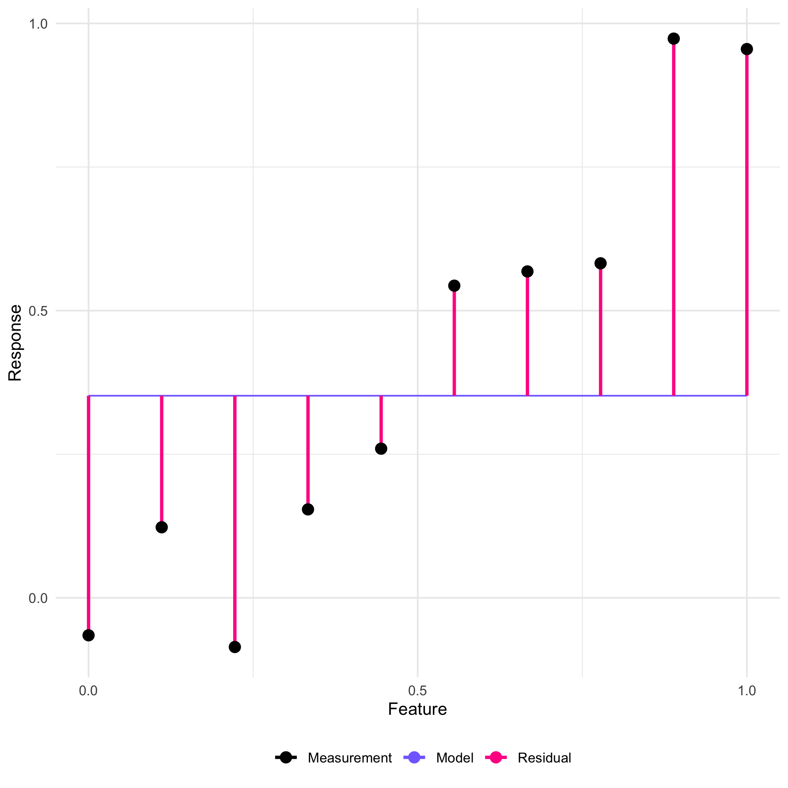
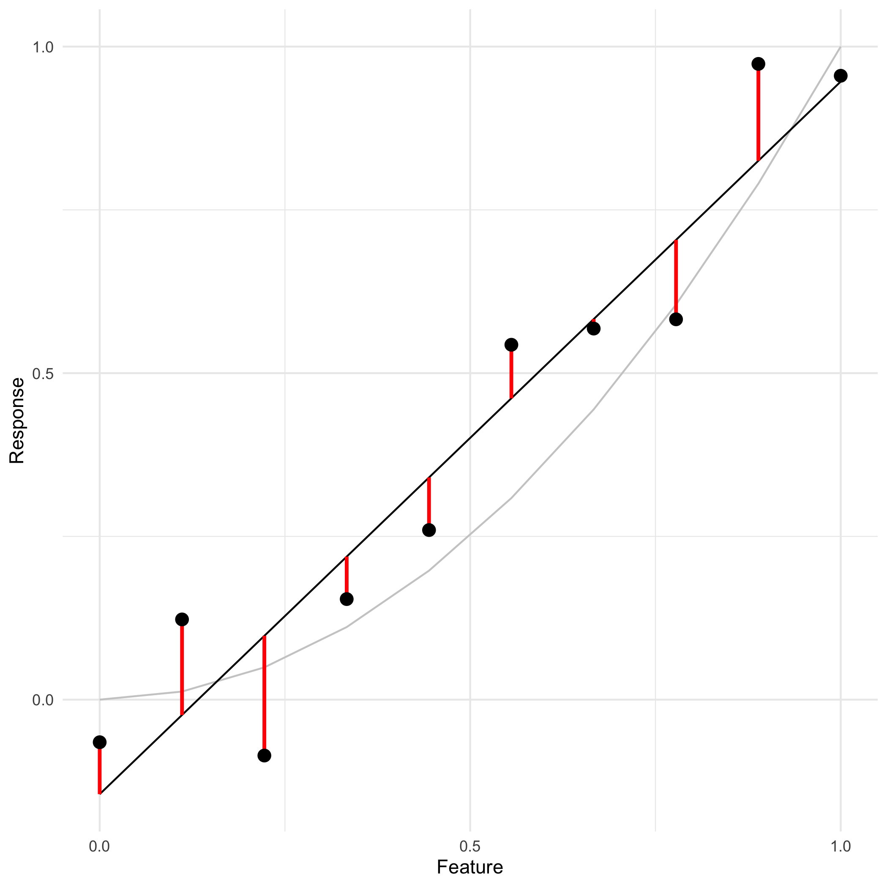
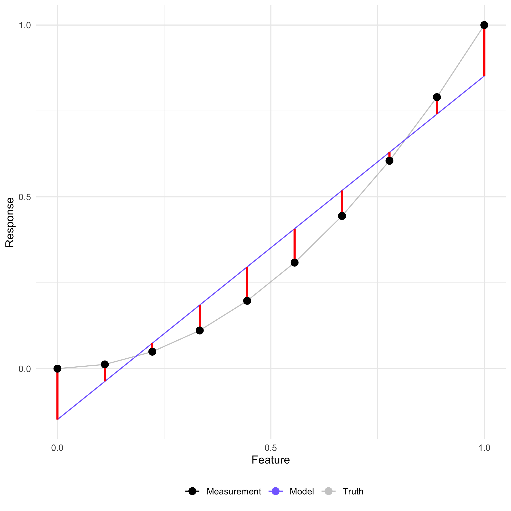
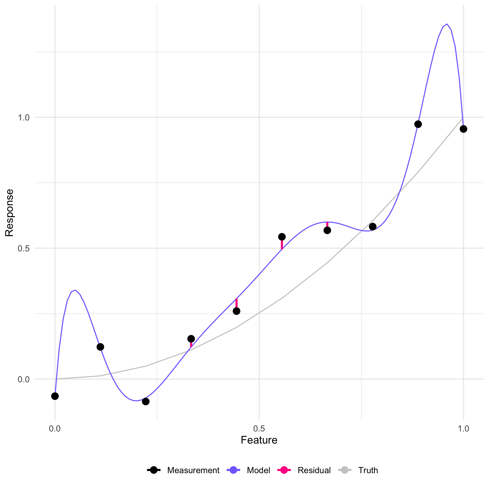
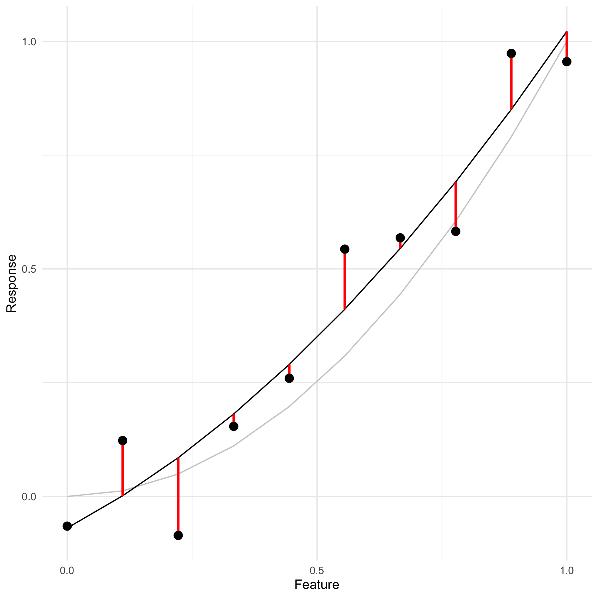
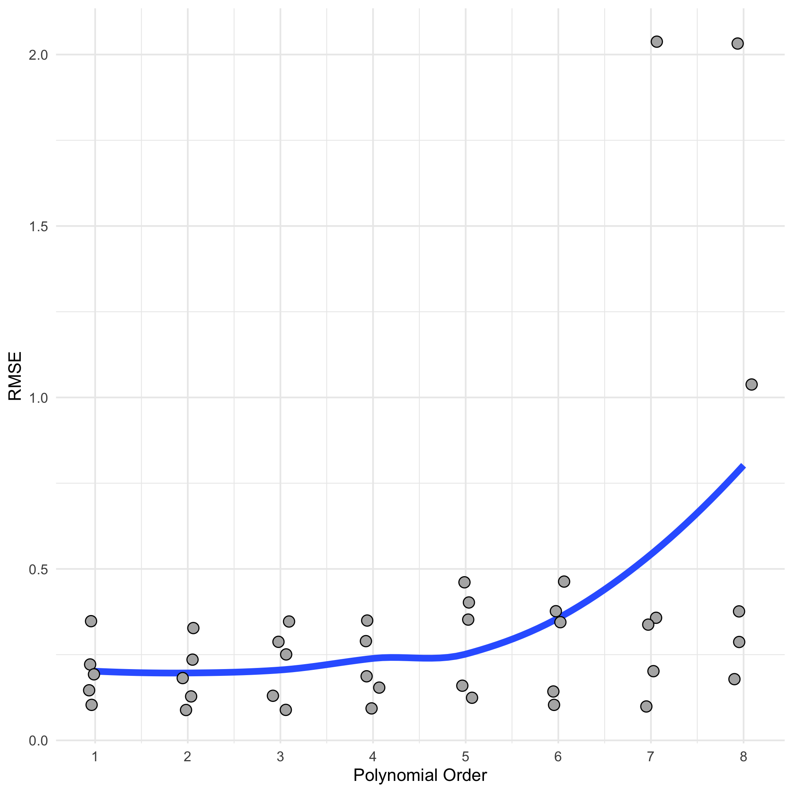

[Drew Conway](http://drewconway.com/zia/2013/3/26/the-data-science-venn-diagram)
writes of people with "hacking skills plus substantive expertise" as living in
the _danger zone_.

The idea here is that applying machine learning models without any understanding
of math or statistics is _dangerous_, in the sense that someone in the _danger
zone_ can easily build and apply models without realizing they've made a grave
mistake.[^1] Of course, we're not going to be able to teach you everything you
need to know about math and statistics in a one-day workshop. But we can pick
out an important slice of content, and lay a foundation for further study.

## Fitting a Machine Learning Model
<!-- -------------------------------------------------- -->

The _general strategy_ in machine learning is to define a _parameterized family
of models_, and use data to _tune_ the parameters. For instance, let's imagine
we have a single feature (input) and a single response (output). We could start
by ignoring the single feature, and try to fit a single value that "best"
describes the data.

Here the model predictions are represented by the solid "Model" curve. The
vertical lines represent the discrepancy between the data and the model -- these
are called _residuals_. Generally, we quantify the quality of the fit in terms
of these discrepancies. The _mean squared error_ (MSE) is nothing more than the
sum-of-squares of these residuals.

From the figure above, we can see that this "constant model" is quite bad; it's
clearly missing the relationship between the input and output. As an
improvement, we could fit a line `y ~ m x + b` on the data, visualized below.
While this new model picks up some of the trend, it is not a perfect
representation of the underlying _data-generating process_ -- the underlying
function (Truth) is quadratic, and the measurements are corrupted by noise.

"Fitting" this model is accomplished by changing the _parameters_ `m, b` in
order to minimize the error, quantified by the mean squared error. This can be
done by hand, but such a fitting procedure is implemented in scikit-learn. The
following python code will generate some `X,Y` data, fit a line model, and
compute various error metrics.

~~~
import numpy as np
from sklearn.linear_model import LinearRegression

## To build X such that every row is an observation,
## we need to transpose the vector
X = np.atleast_2d(np.linspace(0, 1, num = 10)).T
Y = X**2

## Fit the model
regression = LinearRegression().fit(X, Y)
## Predict with the model
Y_predicted = regression.predict(X)

## Compute the error using various metrics
Residuals = (Y - Y_predicted)**2

MSE  = np.sum(Residuals) # Mean Squared Error
RMSE = np.sqrt(MSE)      # Root Mean Squared Error
NDE  = RMSE / np.std(Y)  # Non-Dimensional Error
~~~
{: .language-python}

> ## Parameters
> Parameters are model-controlling values that are set by minimizing
> the error between model predictions and measurements in our data.
> This process of setting parameters is called _fitting_ a model.
{: .callout}

## Underfitting and Overfitting
<!-- -------------------------------------------------- -->

There are several phenomena at play when fitting a machine learning model: We
will separate out these various components to discuss some of the ways in which
models can fail.

### Underfitting
<!-- ------------------------- -->

A model is said to _underfit_ when it is not sufficiently flexible to capture
the trends in the data. Below we can see an example of this phenomenon -- the
true function is quadratic, there is no noise in the measurements, and yet there
is error in the model fit. This is because the linear model `y ~ mx + b` is
_fundamentally incapable_ of representing the true behavior `y = x^2`.

To reduce the error due to underfitting, we must make the model _more flexible_.
We can do this in the regression context by considering higher-order
polynomials.

### Overfitting
<!-- ------------------------- -->

On the other extreme, a model is said to _overfit_ when it begins to capture
spurious patterns in the data. In the following example, the measurements are
corrupted by noise, and a high-order polynomial is used to fit the data. We can
see that the discrepancy between the model and points is greatly reduced, but
the model exhibits a number of _suspicious wiggles_, particularly near the
endpoints.

One way to reduce the error due to overfitting is to make the model _less
flexible_. This will prevent the model from using its flexibility to tortuously
fit every data point provided.

### Adding flexibility
<!-- ------------------------- -->

One way we can add flexibility to a (regression) model is to increase the
polynomial order. The following python code uses the scikit-learn function
`PolynomialFeatures()` to generate polynomial features, allowing us to fit
a quadratic (or higher order) polynomial.

~~~
import numpy as np
from sklearn.linear_model import LinearRegression
from sklearn.preprocessing import PolynomialFeatures

## Generate data
X = np.atleast_2d(np.linspace(0, 1, num = 10)).T
Y = X**2

## Generate polynomial features
poly_quad  = PolynomialFeatures(2)      # Quadratic polynomial
X_features = poly_quad.fit_transform(X) # Generate features on data

## Fit the model
regression_quad = LinearRegression().fit(X_features, Y)
## Predict with the model
Y_predicted = regression_quad.predict(X_features)

# Note that we have to use data with the appropriate features
# with regression_quad; this is why we must pass X_features
# rather than the original data X

## Compute the error using various metrics
Residuals = (Y - Y_predicted)**2

MSE  = np.sum(Residuals) # Mean Squared Error
RMSE = np.sqrt(MSE)      # Root Mean Squared Error
NDE  = RMSE / np.std(Y)  # Non-Dimensional Error
~~~
{: .language-python}

### Splitting the difference?
<!-- ------------------------- -->

If we tend to _underfit_ when a model is _not flexible enough_, but tend to
_overfit_ when a model is _too flexible_, how do we choose a well-specified
model? Put in machine learning terminology, how do we fit the _hyperparameters_
-- the tunable knobs for model flexibility?

To solve this problem, we will need to distinguish between our
_estimates_ of the error, and the _true_ error between our model and the
underlying function. This discussion will lead us to a useful tool for fitting
machine learning models -- cross-validation.

> ## Hyperparameters
> Hyperparameters are model-controlling values that are not set
> during model fitting. They generally control the degree of model
> flexibility.
{: .callout}

As an example, the polynomial coefficients above are _parameters_, while the
choice of polynomial order is a _hyperparameter_.

## Training a Model
<!-- -------------------------------------------------- -->

Since our model has both _parameters_ and _hyperparameters_, we need a strategy
to fix both of these sets of values. This iterative process of fixing
hyperparameter values, fitting and evaluating the model, and updating the
hyperparameters is called _training_ a model. We will illustrate this process
below to highlight some of the relevant training issues.

### A "correctly-specified" model
<!-- ------------------------- -->

Below we fit a quadratic model to data generated from a quadratic rule. The
difference between the Model and the Truth shows that our fit is not perfect,
even though we've "correctly-specified" the model.

If we were to use the true model to evaluate the residuals, we would find the
following picture.

Despite using the _true model_ to evaluate the residuals, there is clearly
nonzero error. This is because the _noise_ corrupting the measurements sets a
lower bound on the error _that we can evaluate using our measurements_. This
highlights an important statistical fact:

> ## Estimating Error
> Regardless of what metric we choose, any error we compute with data
> is only an estimate.
{: .callout}

Statistics is the mathematical language we use to construct improved estimates.
If we want to do a better job estimating the error, we'll have to use
statistics. __This is (part of!) why statistics is important for doing machine
learning well.__

Of course, we don't need to do a PhD in statistics to use machine learning
tools. There are a number of statistical tools we can leverage to aid in
training a model. In the case where we do not have an overabundance of data,[^2]
_cross-validation_ is a good option.

### Estimating error with cross-validation
<!-- ------------------------- -->

[Cross-validation](https://en.wikipedia.org/wiki/Cross-validation_(statistics))
is a family of techniques for estimating how the error in a fitted model will
generalize to a new situation. The following graphic depicts _k-fold cross
validation_, where we split the data into k "folds" -- disjoint subsets -- of
data. We then proceed in k steps of fitting, where we fit the model on k-1
folds, and _test_ the model on a _held-out_ fold. Since the test data were not
used to fit the model, the test error tends to be a "less optimistic" estimate.

<figure>
  
  <figcaption>
    Fabian Flock, via Wikimedia
  </figcaption>
</figure>

K-folds cross-validation then provides k estimates of the error, which we may
average or otherwise summarize. These estimates are especially valuable for
_tuning hyperparameters_. For instance, we could fit our model at a variety of
hyperparameter values, perform k-fold cross-validation at each setting, and
choose the hyperparameters which minimize the estimated error. The following
figure carries out exactly this procedure over the previous data, sweeping over
polynomial order and carrying out 5-fold cross-validation.

Note that the results are a bit ambiguous: Orders 1 through 4 are roughly
equivalent. However, these results do suggest that picking a polynomial order
greater than four would lead to overfitting, which is useful information.

## Exercise
<!-- -------------------------------------------------- -->

> ## Exercise: Machine Learning
>
> Complete [06_ml_exercise.ipynb](../files/exercises/06_ml_exercise.ipynb)
{: .challenge}

[^1]: Mistakes of the sort for which software does not have an error message, like p-hacking or abusing the interpretation of regression coefficients.
[^2]: There exist many ways to estimate the error in a model. Cross-validation is especially helpful when we do not have _a ton_ of data, and want to use it efficiently. Other approaches include the train-test-validate framework, which splits the data in a different way.


